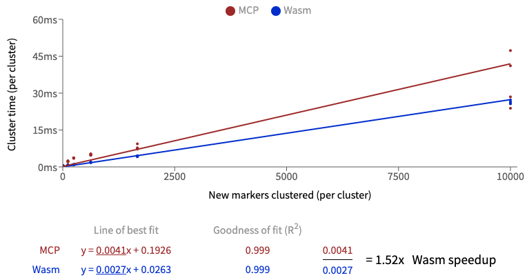

# wasm-marker-clusterer

[](https://travis-ci.org/stefan2718/wasm-marker-clusterer)

`wasm-marker-clusterer` is a much faster alternative to the popular [MarkerClustererPlus](https://github.com/googlemaps/v3-utility-library/tree/master/markerclustererplus) (MCP) library for [Google Maps](https://developers.google.com/maps/documentation/javascript/marker-clustering). It is compiled from Rust into [WebAssembly](https://developer.mozilla.org/en-US/docs/WebAssembly). This library is used to cluster geographic markers (lat/lng pairs) into labelled clusters of markers, to simplify a map view.

**5x-15x times faster than the Javascript implementation.**

[See the demo here to create a graph of your own speed-up results.](https://stefanbattiston.com/lab/webassembly-marker-clusterer)


[Why "(per cluster)" on the axises?](#why-per-cluster-on-the-graph-axes)

## Comparison

Unlike MCP, this library can be used independent from Google Maps, as it only handles data, not the UI.

Here's a quick summary of the differences:
| Does it...?| MCP | Wasm |
|-------	  |----	|---	|
| Cluster map points? | Yes | Yes |
| Work with any map system? | No, only Google Maps | Yes, any map system |
| Use a restrictive marker renderer? | Yup, you have to overwrite the library's prototypes if really want to customize your markers. | No, is not tied to any renderer. You can define interactive and beautiful markers|
| Run in the main thread, blocking rendering? | Yup, and it'll slow down your whole app if you have lots of markers. | No, runs in a Web Worker so your app remains responsive while it calculates.
| Handle lots of markers seamlessly? | Starts to noticeably slow down after about 1000 markers | Easily clusters 10,000 markers or more

## Installation
This package has a peer-dependency on the **Webpack** plugin [GoogleChromeLabs/worker-plugin](https://github.com/GoogleChromeLabs/worker-plugin) which is used to load the WASM module in a web worker.

```shell
npm install wasm-marker-clusterer
npm install -D worker-plugin
```

Then add worker-plugin to your **webpack.config.js:**

```diff
+ const WorkerPlugin = require('worker-plugin');

module.exports = {
  <...>
  plugins: [
+    new WorkerPlugin()
  ]
  <...>
}
```

## Usage

```javascript
import { WasmMarkerClusterer } from "wasm-marker-clusterer";

let clusterer = new WasmMarkerClusterer();

// See `Configuration` section below for all configurable parameters
await clusterer.configure({ gridSize: 60 });

await clusterer.addMarkers([
  { lat: 43.6358644, lng: -79.4673894 },
  { lat: 43.893691,  lng: -78.9528484 },
]);

let zoom = 8;
// Takes a geographic bounds object, and the zoom level, and returns clusters that are within it.
let clusters = await clusterer.clusterMarkersInBounds({
  north: 43.9,
  south: 43.5,
  east: -78.9,
  west: -79.5
}, zoom);
```

You can also check out [the source code of the demo page](https://github.com/stefan2718/personal-website/blob/v1.1.0/src/components/lab/WasmMap.tsx) to see a fully functioning code example.

## Configuration

[All configurable parameters defined in the interface file.](./js/interfaces.ts)

## API

All the custom Typescript types in this API are [defined in the interface file.](./js/interfaces.ts)

```typescript
export declare class WasmMarkerClusterer {
  /**
   * Merges any passed config parameters into existing config.
   * Clears cached clusters if `averageCenter` or `gridSize` is modified.
   */
  configure: (config: IConfig) => Promise<void>;

  /**
   * Calculates clusters for the markers within the given bounds.
   * @returns Newly calculated clusters merged with any previously calculated clusters
   */
  clusterMarkersInBounds: (bounds: IBounds, zoom: number) => Promise<ICluster[]>;

  /**
   * Add an array of lat/lng markers so that they can be clustered.
   */
  addMarkers: (markers: IMarker[]) => Promise<void>;

  /**
   * Clears all added markers and calculated clusters.
   */
  clear: () => Promise<void>;

  /**
   * Clears only calculated clusters.
   */
  clearClusters: () => Promise<void>;
}
```

## Implementation

This library is mostly a Rust port of the original MarkerClusterPlus library, with some tweaks to remove dependencies on the Google Maps Javascript API, and without any of the GUI code.

The library has a few levels of abstraction to make it easy to work with, without having any knowledge of Rust or WebAssembly.

- At the core is Rust code, compiled to Wasm.
- The resulting Wasm module (and [wasm-bindgen](https://github.com/rustwasm/wasm-bindgen) glue code) is loaded inside a Web Worker using `worker-plugin`
- A Typescript wrapper class loads the Web Worker, and uses [comlink](https://github.com/GoogleChromeLabs/comlink) to simplify the calls to the Web Worker into Promises. It also manages some state to minimize how much data needs to be serialized between the Wasm/JS boundary.

Here's a high-level summary of how the clustering algorithm works in this library and MCP:

```javascript
for all the markers:
  if (the marker is not already in a cluster) AND (the marker is within the requested map bounds):
    // Add to the closest cluster:
    for all existing clusters:
      calculate the distance to this marker and choose the closest cluster
    if the closest cluster is less than GRID_SIZE pixels away:
      add the marker to this cluster
    else:
      create a new cluster with this marker as the center
```

### Why "(per cluster)" on the graph axes?

If you look at the axis labels on the graph at the top of this readme, you'll notice they are:

- `Cluster Time (per cluster)`
- `New Markers Clustered (per cluster)`

The clustering algorithm has a complexity of `O(n*c)` where `n` is number of markers, and `c` is the number of clusters. 

Because of this, it will take longer to cluster the same number of markers into 10 clusters than it will for 1 cluster.

Also note that the majority of the CPU time is spent finding a cluster for a marker that _has not already been clustered_. That's why the x-axis is labeled **New** Markers Clustered.

Therefore in order to accurately fit a straight line to this data, the `cluster time` (how long it took to cluster the markers) and the `number of new markers clustered` must both be divided by `c` the number of clusters. 

